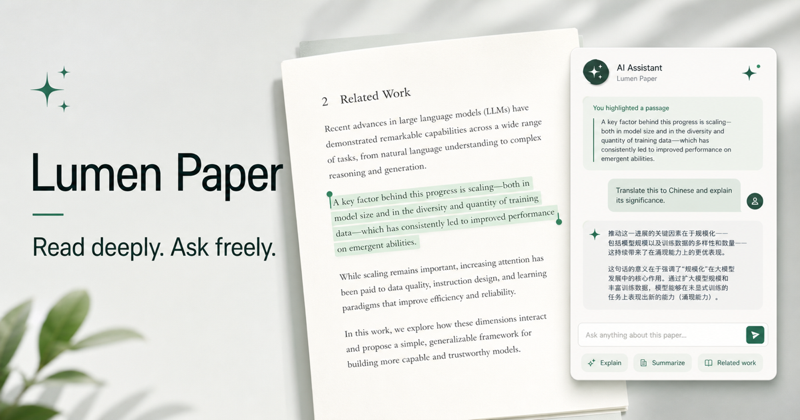
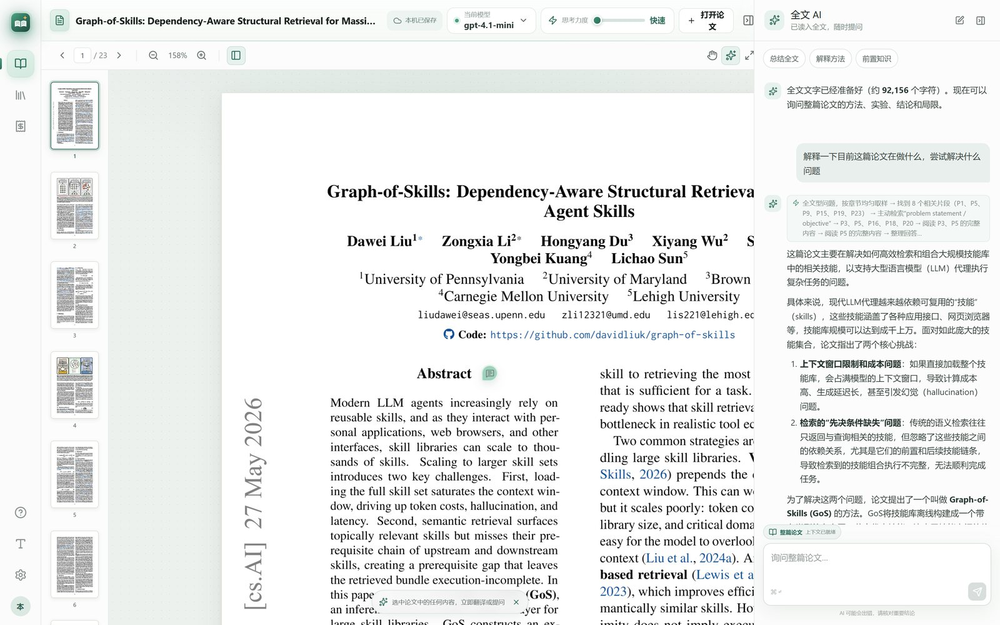
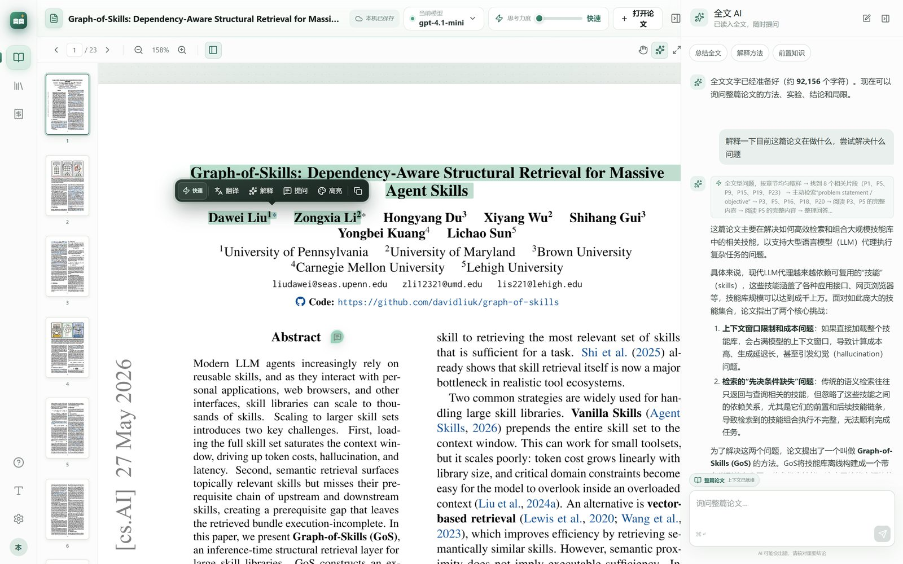
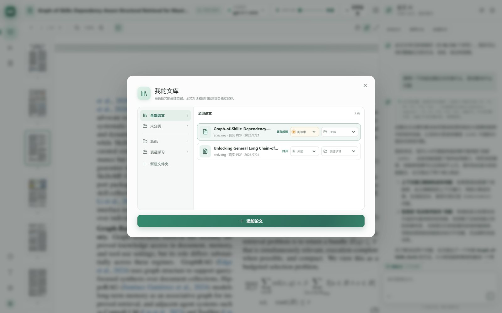
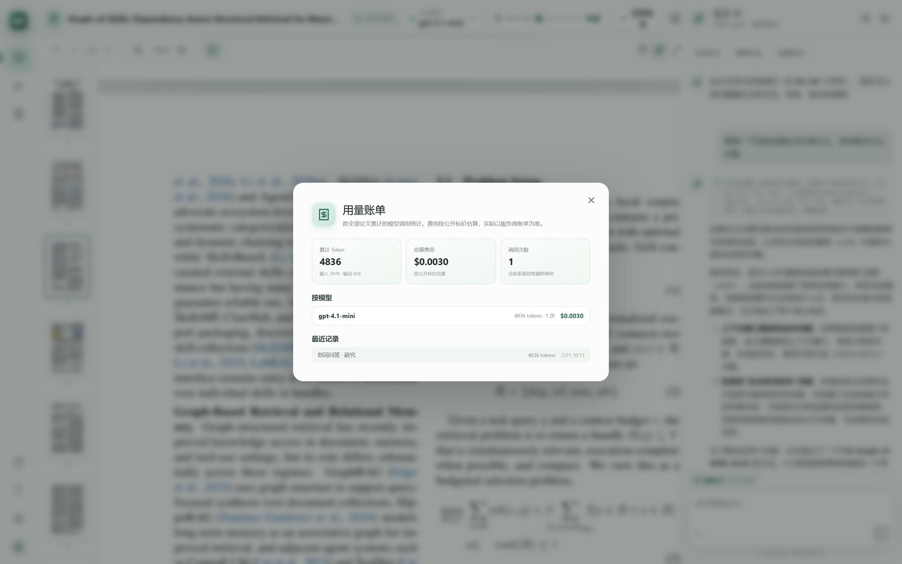

# 文枢 Wenshu

文枢（Wenshu）是一个本地优先的 AI 论文阅读器。它可以打开 arXiv 等网站的 PDF 或本地论文，在原文旁完成翻译、解释、追问、高亮和批注，并保存文库、阅读位置与对话记录。



## 功能

- 打开 arXiv PDF 链接或上传本地 PDF
- PDF 文本层解析与精确跨行选择
- 选中文本后翻译、解释、连续追问或多色高亮
- 原文旁可拖动的 AI 卡片与批注标记
- 公式区域识别与公式解释入口
- 全文 AI 多轮对话，支持 Markdown 与 LaTeX 公式渲染，SSE 流式输出
- 三档 AI 思考力度：快速（本地检索 + 单次作答，零额外模型调用）、深入（查询改写 + 两轮查漏补缺）、研究（Agent 多轮主动检索，步骤可见）
- 服务端按页/标题/段落切分 chunk，查询改写为中英双语检索词后打分召回，回答带页码引用
- 文件夹式论文文库
- 持久化论文、阅读进度、对话、高亮和批注
- OpenAI 兼容接口，可自定义 Base URL、API Key 和模型
- 本地 SQLite（Cloudflare D1）与本地对象存储（R2）开发模式
- 可选 Supabase 邮箱、Google 和游客登录

## 界面预览

| 阅读器主界面 | 划词即译 / 即问 |
| --- | --- |
|  |  |

| 文件夹文库与阅读状态 | 全局用量账单 |
| --- | --- |
|  |  |

## 本地运行

需要 Node.js `>=22.13.0`。

### 一键启动

```bash
git clone https://github.com/kyre-99/lumen-paper-reader.git
cd lumen-paper-reader
```

- Windows：双击 `scripts/setup.bat`（或在终端执行）
- macOS / Linux / Git Bash：`./scripts/setup.sh`

脚本会自动完成依赖安装、生成带随机密钥的 `.dev.vars`、初始化本地数据库并启动。之后再次启动只需重新运行同一脚本。

### 手动步骤

```bash
npm install
cp .env.example .dev.vars
npm run local
```

打开终端显示的本地地址即可使用。一键脚本会自动生成下面的配置；手动安装时，默认建议在 `.dev.vars` 中设置：

```env
LOCAL_ONLY=true
GUEST_SESSION_SECRET=请替换为至少32位的随机字符串
MODEL_CONFIG_SECRET=请替换为至少32位的随机字符串
```

本地模式不要求 Supabase 或第三方账号登录。文库和结构化数据保存在 `.wrangler/state/` 的本地 D1 中，上传的 PDF 保存在本地 R2 中。该目录不会提交到 Git；删除它会清空本地数据。

## 接入模型

可以在应用右上角的 AI 设置中填写 OpenAI 兼容配置，配置只需保存一次。也可以通过 `.dev.vars` 提供默认值：

```env
OPENAI_BASE_URL=https://api.openai.com/v1
OPENAI_API_KEY=your_api_key
OPENAI_MODEL=gpt-4.1-mini
```

第三方兼容服务的 Base URL 通常应包含 `/v1`。请勿提交包含真实密钥的 `.dev.vars`；该文件已加入 `.gitignore`。

## 可选云端登录

如需启用 Supabase 登录和跨设备账户，可在 `.dev.vars` 中配置：

```env
LOCAL_ONLY=false
SUPABASE_URL=https://your-project.supabase.co
SUPABASE_PUBLISHABLE_KEY=sb_publishable_your_key
```

Google 登录还需要在 Supabase 和 Google Cloud Console 中配置 OAuth Provider 与回调地址。本地阅读和本地持久化不依赖这些设置。

## 常用命令

```bash
npm run local       # 初始化本地数据库并启动开发环境
npm run dev         # 启动开发环境
npm run build       # 生产构建
npm test            # 构建并运行测试
npm run lint        # ESLint 检查
npm run db:generate # 根据 schema 生成 Drizzle migration
```

## 技术栈

- React 19、Next.js API Routes、vinext、Vite
- PDF.js
- Cloudflare D1、R2、Wrangler
- Drizzle ORM
- Supabase Auth（可选）
- React Markdown 与 GFM

## 数据与安全

- `.dev.vars`、`.env`、`.wrangler/state/`、构建产物和上传文件不会进入 Git。
- 模型 API Key 不会发送给除所配置模型接口以外的第三方。
- 对外部署前请使用随机的 `GUEST_SESSION_SECRET` 和 `MODEL_CONFIG_SECRET`。
- AI 输出可能有误，重要论文结论请回到原文核对。

## License

[MIT](LICENSE)
